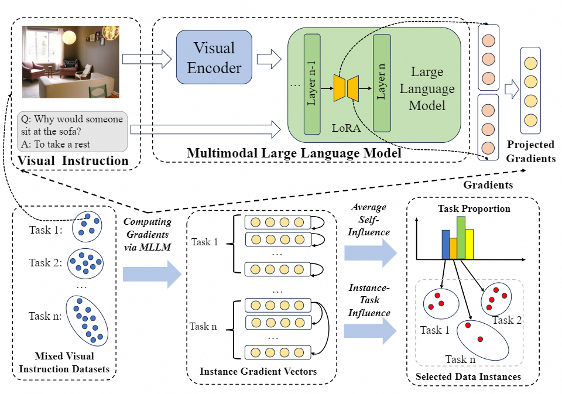
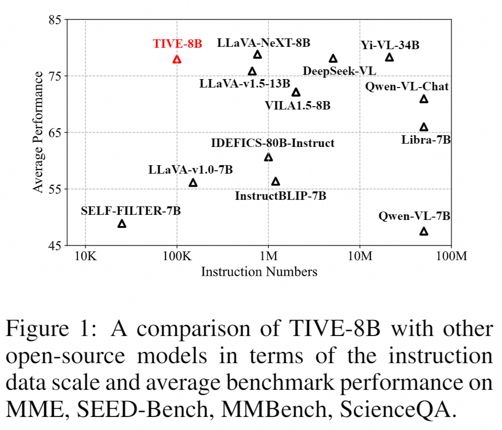

## Less is More: High-value Data Selection for Visual Instruction Tuning

This repo provides the source code & data of our paper: [Less is More: High-value Data Selection for Visual Instruction Tuning](https://arxiv.org/abs/2403.09559).


## Overview

In this paper, we study the redundancy issue within the current visual instruction datasets. We conduct a series of empirical studies which reveals a significant redundancy within the visual instruction datasets, and show that greatly reducing the amount of instructions from several tasks even do not affect the performance. Based on the findings,
we propose a high-value data selection approach TIVE, to eliminate redundancy within the visual instruction data and reduce the training cost. Experiments on various LVLMs (Large Vision-Language Models) show that our approach using only about 15% data can achieve comparable average performance to the full-data fine-tuned model across eight benchmarks, even surpassing it on four of the benchmarks.





## Installation
1. Install LLaVA

Please follow [LLaVA](https://github.com/haotian-liu/LLaVA) for installation.

2. Install trak
```Shell
pip install peft==0.7.1 traker[fast]==0.1.3
```

If you try to test TIVE on other models, please refer to [Bunny](https://github.com/BAAI-DCAI/Bunny) to test MLLMs with other LLM backbone with minimal modification.

## Usage
TIVE mainly consists three steps to select a high-value data subset for visual instruction tuning. First, we sample a minimal amount of warm-up data to train a reference model. The reference model is later used to compute gradient features. Second, we obtain the gradient features via back propagation and project these features to low dimension via random projection. Last, we compute the data value on task-level and instance-level and select the final subset based on the data value.
  
### Train a reference model:
1. Sample warm-up data
```Shell
python select_warm_up_data.py \
    --source_path source_data_path \
    --target_path target_data_path \
    --sample_ratio 0.08 \
```

2. Train a reference model
```Shell
bash finetune_lora.sh
```
Please follow the guide in [LLaVA](https://github.com/haotian-liu/LLaVA) to set the correct argument for training. You need to modify --data_path to your warm-up data path.

### Compute and project gradient features
Single-gpu
```Shell
CUDA_VISIBLE_DEVICES=0 python compute_gradient_features.py \
    --input_file llava_v1_5_665k.json \
    --model_path reference_model \
    --model_base vicuna-7b-v1.5 \
    --output_file gradient_path 
```

We haven't found way to parallel compute gradient features and project them. Thus we only utilize the script below:

```Shell
CHUNKS=8
gpus=(0 1 2 3 4 5 6 7)
for IDX in {0..7}; do
    CUDA_VISIBLE_DEVICES=${gpus[$IDX]} python compute_gradient_features.py \
        --num_chunks $CHUNKS \
        --chunk_idx $IDX \
        --input_file llava_v1_5_665k.json \
        --model_path reference_model \
        --model_base vicuna-7b-v1.5 \
        --output_file gradient_path &
done
```

please change the model_path to your reference model path. The model_base should be consistent with the reference model. 


### Measure data value and select high-value data subset
Selecting data subset based on data value.
```Shell
python select_data_TIVE.py \
    --data_path source_data/llava_v1_5_665k.json \
    --save_path save_data \
    --gradient_path gradient_path
```
Please change --gradient_path to your corrsponding one.

### Training new model
```Shell
bash finetune.sh
```
Please change --data_path to your selected data.

## Evaluation

Please follow the evaluation setup in LLaVA.

## Related Projects

- [TRAK: Attributing Model Behavior at Scale](https://github.com/MadryLab/trak)
- [Visual Instruction Tuning](https://github.com/haotian-liu/LLaVA)
- [Bunny: A family of lightweight multimodal models](https://github.com/BAAI-DCAI/Bunny)
- [LESS: Selecting Influential Data for Targeted Instruction Tuning](https://github.com/princeton-nlp/LESS)
